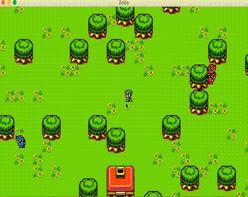

# Games with libGDX

RPG game like Zelda using libGDX Library


## Prerequires

1. Git 2.6+
2. Gradle 2.11+
3. Java 8+


## How to Play

Clone

```
git clone https://github.com/humbertodias/game-zelda-libgdx.git
```

Inside the folder

```
cd game-zelda-libgdx/src
```

Run

```
gradle desktop:run
```


## Output


## How it was made
First I had to download the **App Setup**

[https://libgdx.badlogicgames.com/download.html](https://libgdx.badlogicgames.com/download.html)

And finally create the game using the **Tools**

1. Tiled Map Editor
	
	[http://www.mapeditor.org](http://www.mapeditor.org)


3. Sprites of **The Legend of Zelda: Link's Awakening**

	[http://www.spriters-resource.com](http://www.spriters-resource.com/game_boy_gbc/thelegendofzeldalinksawakening/)

## References

[libGDX HOME](https://libgdx.badlogicgames.com/)

[libGDX with Maven](https://github.com/libgdx/libgdx/wiki/Maven-integration)

